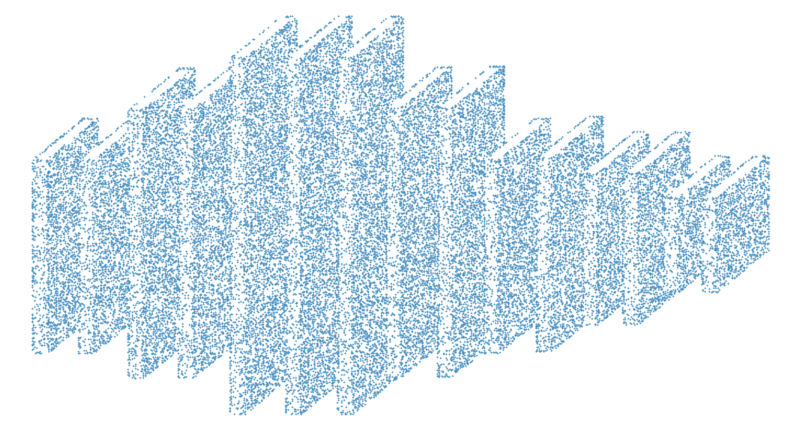
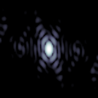
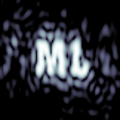

# POPS-ML:  A Machine Learning API Implementation of Phase-Only Pattern Synthesis

## About: 

POPS-ML provides a reference implementation to illustrate the use of
machine learning APIs in the development of optimization problems.  As such,
it requires only the PyTorch and numpy libraries to implement.  Existing complex
linear algebra libraries for PyTorch or Tensorflow would allow for a slightly 
more concise implementation.

This code provides the building blocks for more sophisticated ideas presented in the two papers

- J. C. Kerce, G. C. Brown and M. A. Mitchell, "Phase-Only Transmit Beam Broadening for Improved Radar Search Performance," 2007 IEEE Radar Conference, 2007, pp. 451-456, doi: 10.1109/RADAR.2007.374259; and

- G. C. Brown, J. C. Kerce and M. A. Mitchell, "Extreme Beam Broadening using Phase Only Pattern Synthesis," Fourth IEEE Workshop on Sensor Array and Multichannel Processing, 2006., 2006, pp. 36-39, doi: 10.1109/SAM.2006.1706079.

In the parlance of machine learning, the approach generally parallels the technique of white box adversarial machine learning attacks presented, for instance, in Goodfellow, et. all, *Explaining and Harnessing Adversarial Examples*, DOI: https://arxiv.org/abs/1412.6572

## Demonstration Example

The phase-only pattern synthesis problem is one that arises when trying to generate specially shaped transmit antenna patterns.  An example use might be in matching the transmit shape of a geostationary satellite TV antenna to the shape of a continent or country.  Energy directed outside the desired coverage area, e.g. into the ocean, would represent wasted power and resources.  Similarly, the use of linear gain compomponents for shaping the beam is considerably more expensive than using amplifiers designed to work in saturation.  The decoupling of the antenna shape and beam pattern shape can be accomplished by setting each transmit element in a phased array in a specially crafted way.  Although not demonstrated here, the same effect can be implemented with a parabolic dish.  An engineer once commented to me that one particular optimized dish looked like someone had taken a ball-peen hammer to a perfectly good reflector.

Here we demonstrate the fairly arbitrary decoupling possible between an antenna (with the practically useful characteristics of sparsity and non-uniformity) and the far field beam shape.  The antenna layout is dervied from an images of a CNN diagram from another work, and the target beam pattern are stylized letters reading "ML".  
### Element pattern layout for example array:

### Natural beam pattern:
       

### Beam pattern shaped through phase-only pattern synthesis:

## Use Considerations 
Copyright (C) 2021 by the Georgia Tech Research Institute

License:  POPS-ML is free software.  You can redistribute it and/or modify it 
under the terms of the GNU Lesser General Public License (Version 3) as published by the
Free Software Foundataion.

Citation: Please cite this work as

      J. Clayton Kerce, POPS-ML: A Machine Learning API Implementation of 
      Phase-Only Pattern Synthesis, Apr 2021, DOI: github.com/ckerce/pops_ml

@author Clayton Kerce <clayton.kerce@gtri.gatech.edu>

@date   30 April 2021

